.. _basic:

Basis Installation
==================

System
------
In this documentation a Typo3 version10 in Composer mode is used.

Installation
------------

First install/activate the typo3_forum extension via the Extension Manager.
Go to the extension manager in the page tree and check if the typo3_forum extension is installed and activated.

|
|

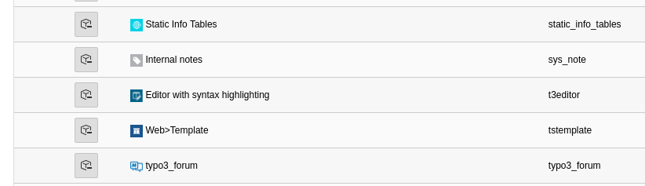

|
|

When typo3_forum extension is installed and activated, in order to use the forum you need to specify a save location. It is best to create a folder for it. Ideally, they create a subfolder for the forum data and the forum user data.

|
|

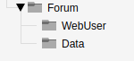

|
|

**Installation of the basic forum:**

Create a new record in the sub folder you just created where your forum data should be stored.
If you have installed and activated the typo3_forum extension correctly, you should see new entries for the Typo3 forum here.
First you need a forum, you can name this as you want.

|
|

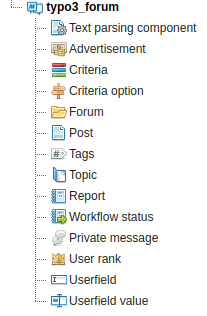

|
|

Fill in the required fields, it is always recommended to include a description.

|
|

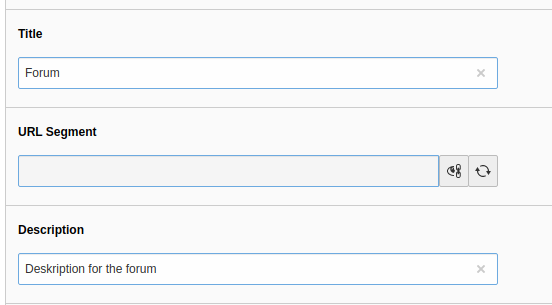

|
|

The option "Children" allows them immediately in this forum entry to create a sub forum.
Any setting for a sub forum they can set here.

|
|

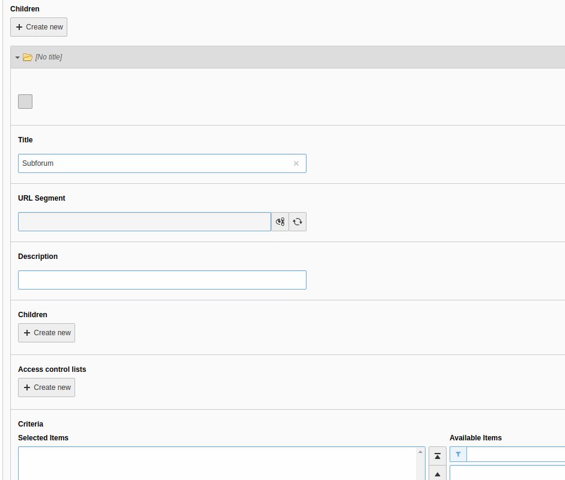

|
|

In the next step you have to define the Access Control Lists (ACL). For the basic installation you define the controls for "Read", "Create new Topics" and "Write Posts".
Here you have to keep in mind that you first have to save the newly created Access Control and then you can change the Login Level. If you do not follow this sequence it can happen that two Access Controls are created.

|
|

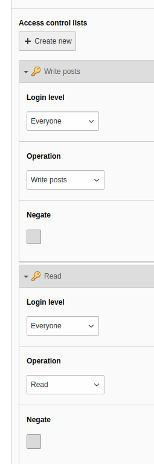

|
|

If you have now saved everything in the correct order, press "close" and it should look like this.

|
|

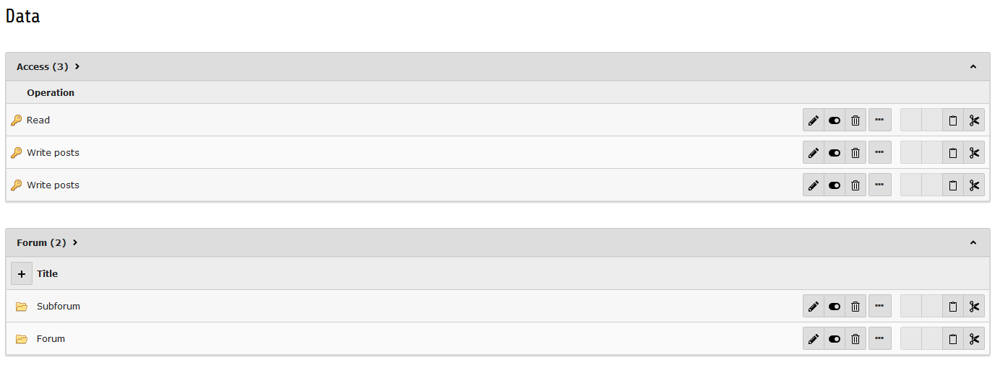

|
|

Next, you need to add the static typo3_forum template to your root page. To do this, go to your root page and add the template record.

|
|

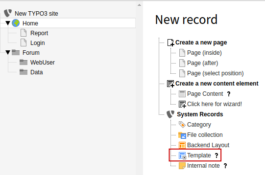

|
|

Fill in the required fields and then go to "Includes". In the tab "Includes" add the static template of typo3_forum extension. Please note that typo3_forum requires the Bootstrap templates.

|
|

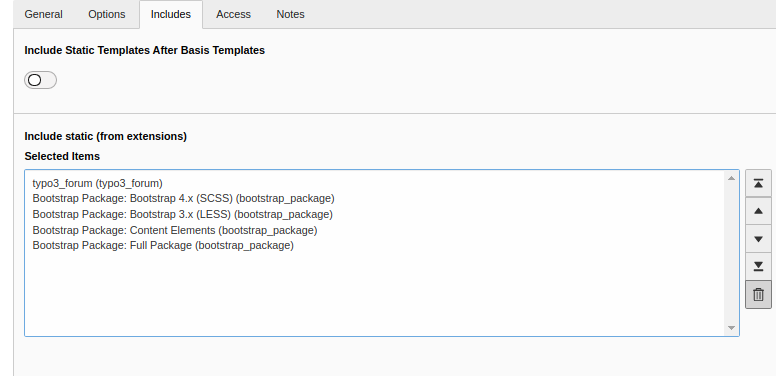

|
|

After adding, go back to the General tab and add the following code in the Setup field:

|
|

.. code-block:: typoscript

    plugin.tx_typo3forum {
            persistence {
                    storagePid = id from data sysfolder
                                    }
            settings {

                    pids {
                            Forum = id from page
                    }
            }
     }

|
|

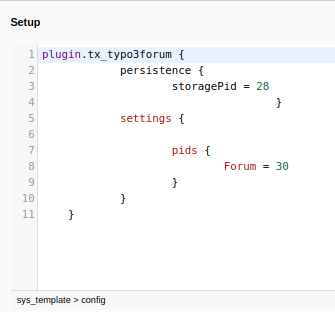

|
|

To display the forum in the Forntend, create a new content element. Create a new record on the page where you want your forum to be displayed.

|
|

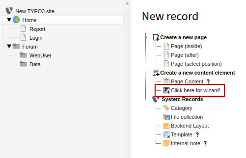

|
|

Go to the Plugin tab and create a general plugin element.

|
|

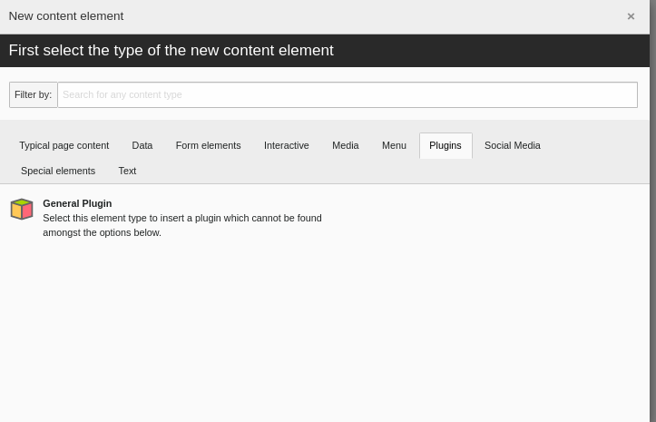

|
|

In the content element settings navigate to Plugin. Here you can configure the content element. To display the forum you have to select "typo3_forum" in the drop down menu. Then confirm with "ok".

|
|

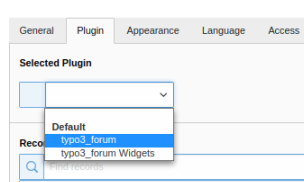

|
|

After this step a few more options for typo3_forum will appear.

|
|

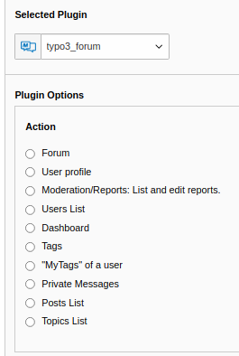

|
|

To display the forum, select Forum.
Then you have to specify where the data for the forum should be stored, in our example it is the folder Data.
You can specify this under the plugin options.
.
|
|

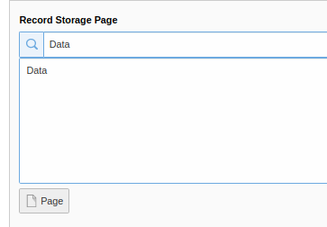

|
|

Now your forum should be displayed on the page where you installed it.

|
|

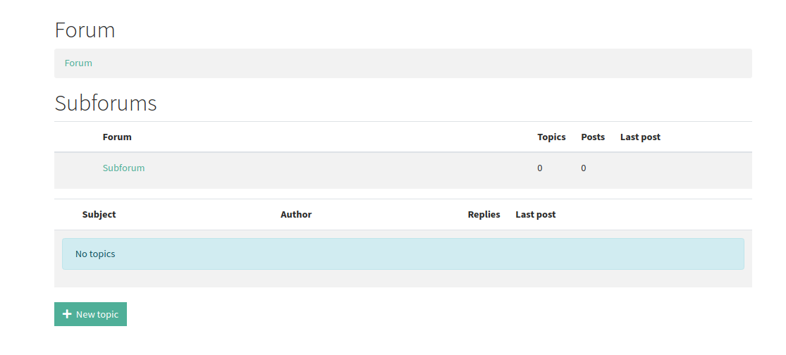

