.. ==================================================
.. FOR YOUR INFORMATION
.. --------------------------------------------------
.. -*- coding: utf-8 -*- with BOM.

.. include:: ../Includes.txt

.. _installation:

Installation
=======================

.. _installation-firststeps:

Installation
---------------------
* The first step to install the typo3_forum extension is – of course – to import it into your TYPO3 environment using the extension manager. To do so, go to the extension manager and select “Get extensions” in the drop-down menu on the top of the page.

Then search for the extension key typo3_forum. After that click on Button “Import and Install”:

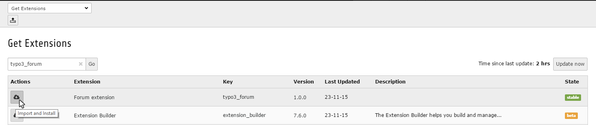

In order to use typo3_forum you need to tell it where to find and store its data. For this, you should create a new SysFolder where your forum data is to be stored. The best solution would be to have a Subsysfolder for forums data and one for the forum user data.

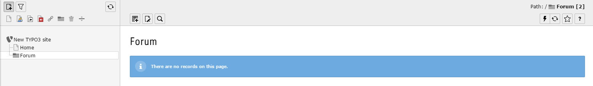

Follow these steps in order to configure typo3_forum:

Create a new Record inside the Forum data Folder you just created. typo3_forum gives you a couple new options. First you’re gonna need a ‘Forum’, you can name it however you want. 

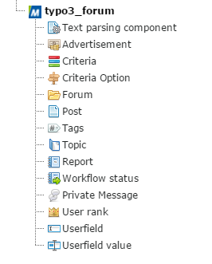

Fill out the fields 'Title' and 'Description' with the content you want. 

.. image:: ../../Images/create-forum.png

With the Option 'Children' you can create subforum directly in this forom record. You can define every option for the subforum seperatly.

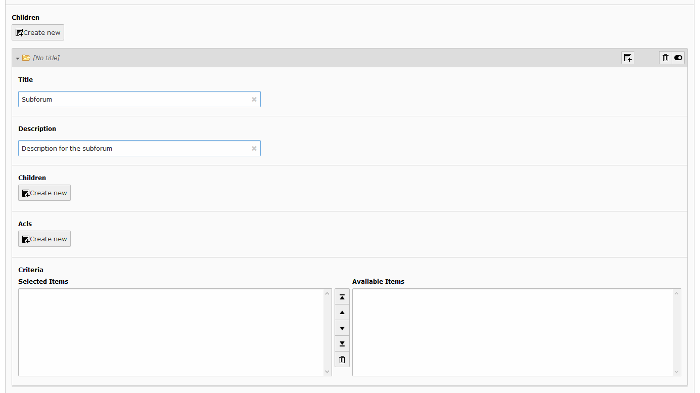

Next you must define the 'ACLs' for the forum operations. For the first installation you can define Login Level to Everyone for the Operations Read, Create new topic and Write posts.

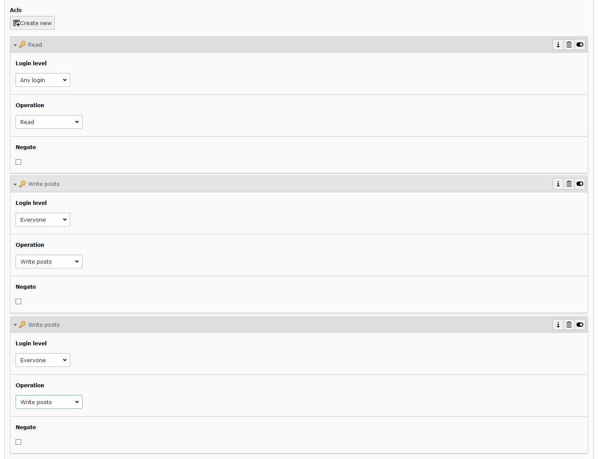

The Option 'Criteria' you can leave blank for the first installation.  

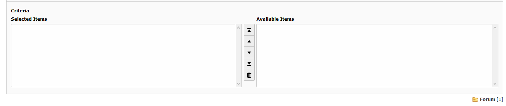

Now press the Button 'Save and Close' to save the record.

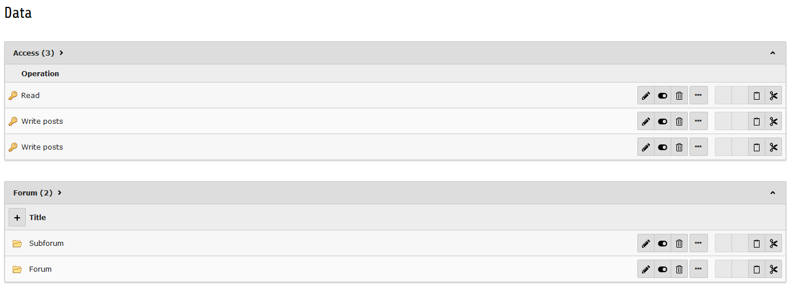

Then you have to include the static template 'typo3_forum' to your Page with the template record. There is a second static template 'typo3_forum Bootstrap Template' for including Bootstrap in Installation. If you already have included Bootstrap in your Site you don't need the secound static template. 

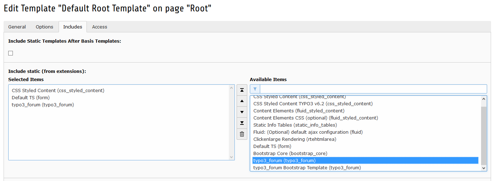

Now you have to set the PIDs via TypoScript for the forums page in setup field. 

::

    plugin.tx_typo3forum {
		persistence {
			storagePid = id from data sysfolder
					}
		settings {
    
			pids {
				Forum = id from page
			}
		}
	}
	
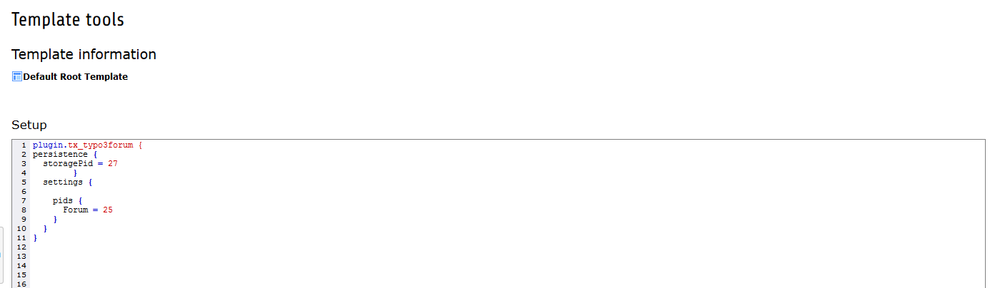

To display your forum in the frontend you have to create a new record on a new page. Now create a new content element in the row where your forum should be displayed. 

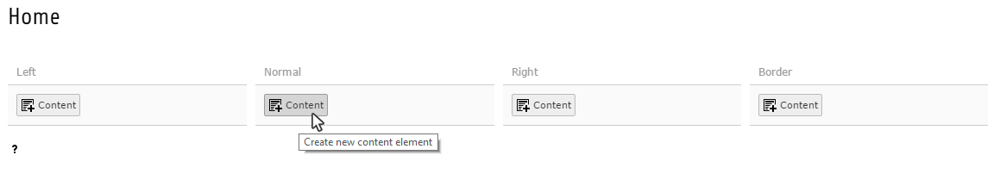

Click on the Tab 'Plugins' and choose the that the ‘General Plugin’ Element.

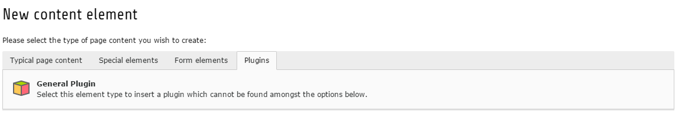

Within the settings in the Plugins - Tab for that Element you need to configure the Plugin. You must choose typo3_forum as  the 'Selected Plugin' and confirm it by pressing the ‘Ok’ Button

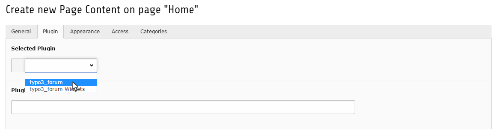

Now a couple more Options should appear, under ‘Plugin Options’ please select ‘Forum’.

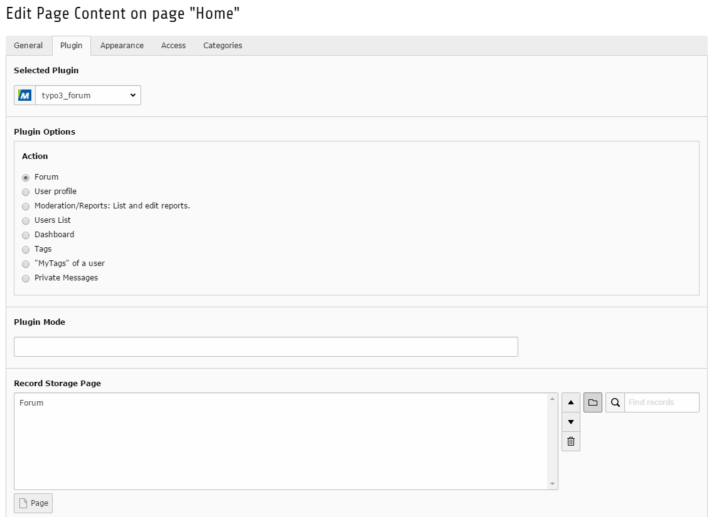

At least you have to tell the Plugin where the forum data is stored, to do so select the folder that contains your data as ‘Record Storage Page’ and then press Save an Close.

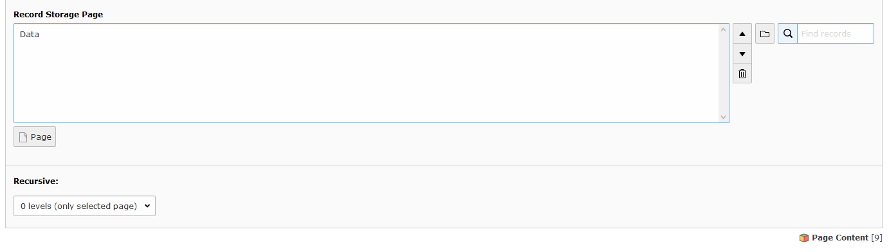

If you’ve followed all the instructions correctly you should end up with a result like that: 

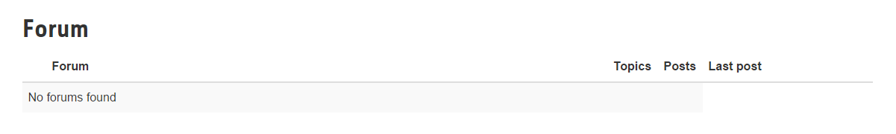
