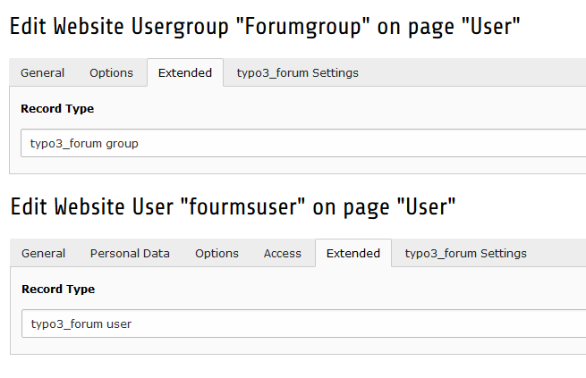

.. ==================================================
.. FOR YOUR INFORMATION
.. --------------------------------------------------
.. -*- coding: utf-8 -*- with BOM.

.. include:: ../Includes.txt

.. _registerandlogin:

Register and Login 
=======================

The central elements of the typo3_forum message board are the boards themselves. These are grouped in categories .Access to boards and categories can be limited to specific user groups. You can specify which groups may read and which groups may write in a certain category or board. This allows you for example to create an internal section in which administrators and moderators can lead internal discussions, an internal board for special work groups or a board that all user can read, but only administrators can write in, that might be used as an announcement board.

Furthermore, you can specify moderator groups separately for each category and forum. Only members of these groups will have moderating access to these categories and forums.

Please note that all permissions that you specify for top level categories are inherited to the categories' child boards.

The user and the usergroup must have the Record Type "typo3_fourm user" and "typo3_forum group". You must define it in the Extend Tab in the user or usergroup record. 

The records must be created in your sysfolder for the user data over the List-View

.. _register:

Register
---------------------

To have a user registration for your forum you must uae the Extension Frontend User Registration (sf_register). You will find a manuel for that here: https://docs.typo3.org/typo3cms/extensions/sf_register/

Login
---------------------

To have a user login for your forum you must use SysExtension Frontend Login (fe_login). 

