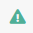
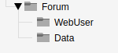
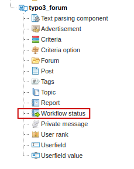
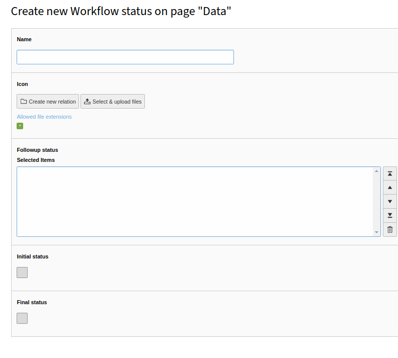
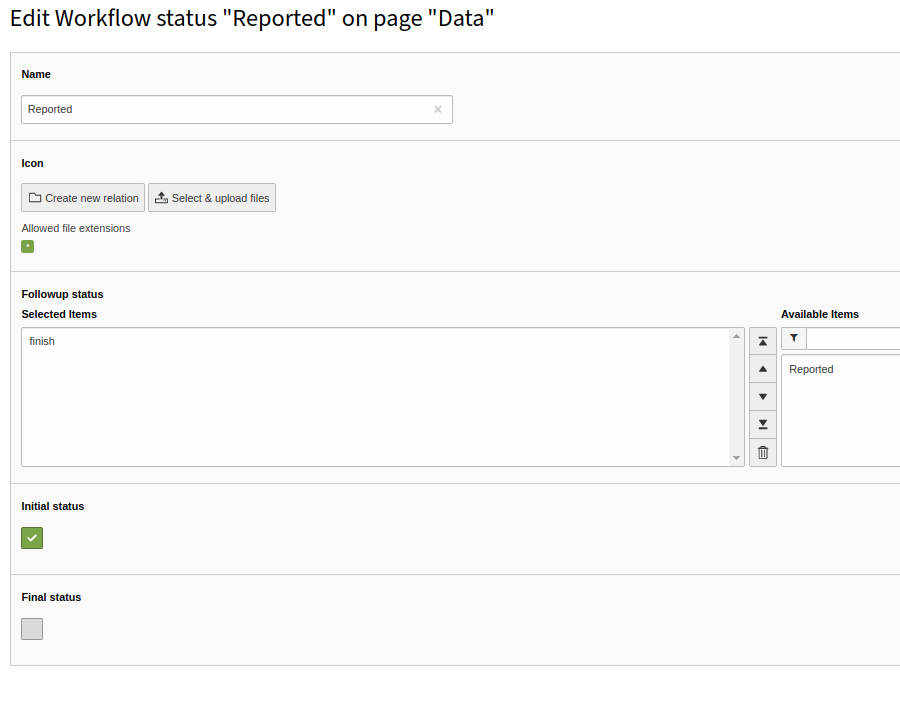
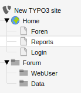
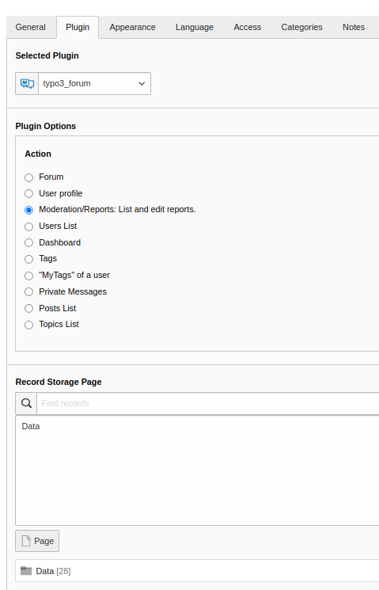
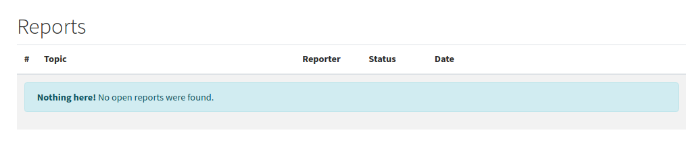

Report
======

Preface
-------

The report tool in typo3forum is used to report posts or users. These reports are then edited by a moderator and if necessary deleted or edited.
Every logged in user can report a user or post.
Reported users or posts can only be edited by typo3 forum users with moderation rights. :ref:`User`.

Installing
------------

In order for the reporting workflow to work properly, the first thing we need to do is create a workflow in the data folder where the forum stores its data.

|

Navigate in your page tree to the folder where your forum data is stored, for us this is Data.

|
|

|
|

Create a new workflow record in this.

|
|

|
|

Now we create a new workflow status, there are two types we can create once the Final status and an Initial status we have to create for the Report Tool, two workflows for each status one.

|

First choose a name for the Initial status and tick the right field. Repeat this process for the Final Status. Then you have created 2 workflows.

|
|

|
|

The Initial status must also get the Followup status of the Final status

|
|

|
|

Displaying the reports in the frontend
-------------------------------

To display the reports in the frontend for the moderators you have to create a new plugin Content elemet. We do this on a new page that we call Reports

|
|

|
|

Here we create a new plugin content element. This will be created exactly as we brought the forum to the frontend. :ref:`basic`.  Now we go again to the tab Plugin in the Content element.

|

- Here we select again the typo3_forum at the plugin.

- In the plugin options we select Moderator/Reports.

- At last we have to specify the location where our forum is stored, for us this is in the folder Data

|
|

|
|

 If you now, as a logged in moderator, go to the Forntend Reports page you will see everything that has been reported.

|
|

