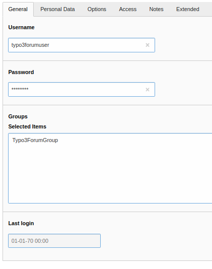
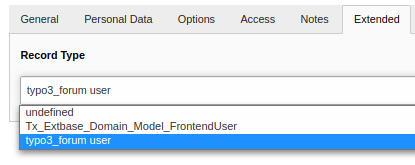
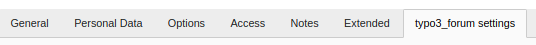
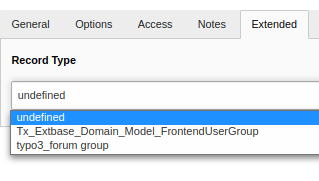
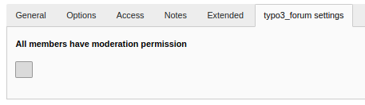

.. _user:

Users and User Groups
=====================

Preface
-------

User and User Group must be extended from typo3_forum.
If the Fe users are not extended from typo3_forum, errors may occur when displaying the forum or creating posts.

Create Frontend user
---------------------

To create a Frontend user that can access the Typo3 forum, create a Frontend user as usual.

|
|

|
|

In order to make the user a typo3forum user, you have to make it a typo3_forum User in the extended tab **before** you save it. If you **don't** do this when creating the user, this will **not** work afterwards.

|
|

|
|

After you have selected the record type, further settings for the now created typo3 forum user appear. We will not go into these settings any further.

|
|

|
|

Moderators
----------

If you want to make a typo3forum user a moderator you have to give him a group that has moderation rights.
So that a group gets moderation rights you have to select this group in the area Extended as typo3_forum_group.

|
|

|
|

In the settings that appear by confirming this operation you can enable the moderator rights

|
|

|
|

If you have followed these steps everything should have worked and you have successfully created a typo3Forum fe_user and typo3_forum.
