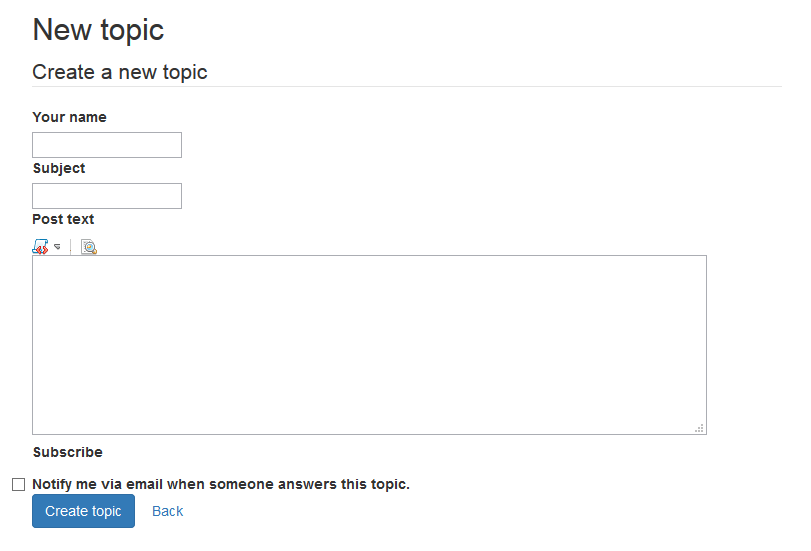

.. ==================================================
.. FOR YOUR INFORMATION
.. --------------------------------------------------
.. -*- coding: utf-8 -*- with BOM.

.. include:: ../Includes.txt

.. _createnewtopicsandposts:

Create News Topics and Posts
=======================

.. _icreatenewtopicsandposts:

Create News Topics and Posts
---------------------

As you know, all posts are organized in topics. Before writing an own post a topic has to be created. Topics are created by clicking the “New Topic” button. You will get an input form where you will be able to enter the new topic's title and the text of the first post of the topic. 

Users can reply to other posts. If a user writes a replying post to another post, it will be appended to the same topic. To reply to a topic, you can either click the button “Reply” at the bottom auf the page or the button “quote” below a specific post. If you hit the “quote” button, you will quote this post in your new post. This will prove useful if you want to refer directly to something another user wrote.

In any case, you will see an input form that is similar to the one you see when you create a new topic. However, you will not be able to specify a title, since only topics have titles.

In both the topic creation and post creation form you will have access to some predefined so-called BBCodes. These allow you to apply some formatting to your post's text (see the regarding chapter).

If you have completed your post, you can hit the “Save”. <